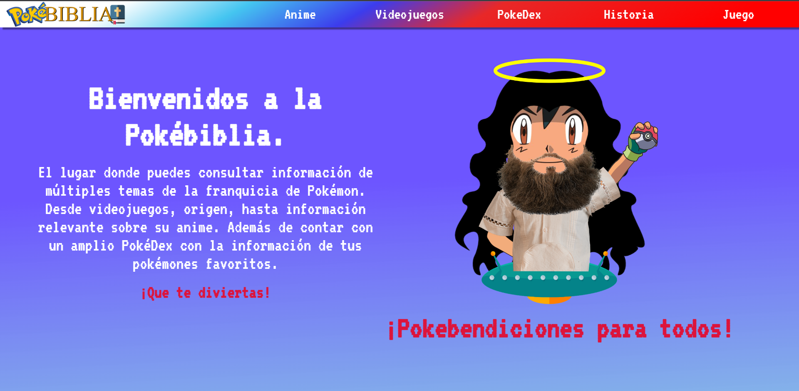
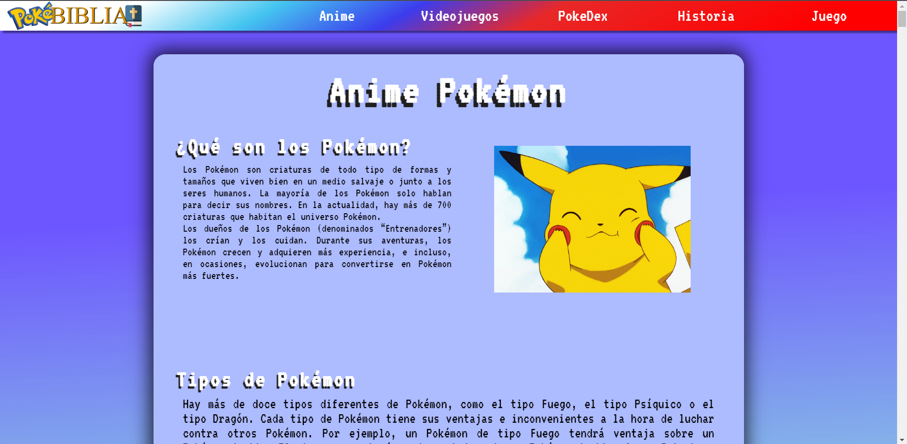
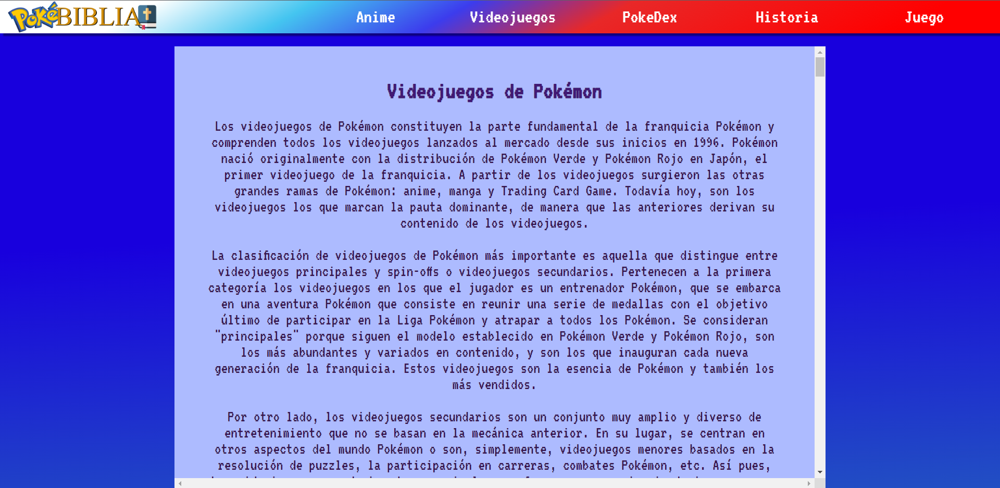
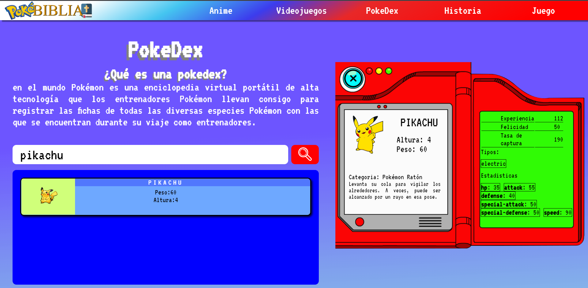
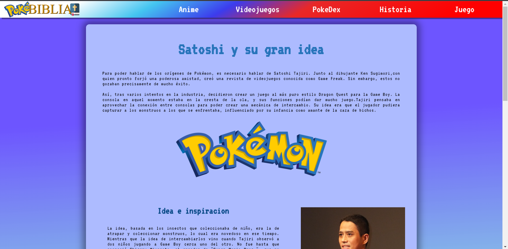
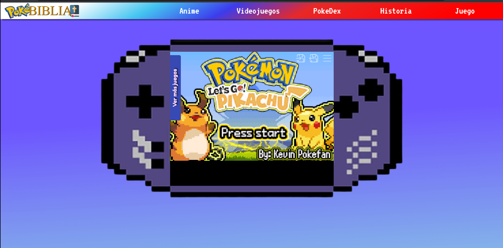

# Pokebiblia

La Pokebiblia is a website in Spanish where you can find topics associated with the franchise such as: anime, curiosities, history, video games, etc.

In addition to being able to search for your favorite Pokémon, with the PokeDex section, where the API "PokeAPI" was used, one of the Rest APIs, the most complete of Pokémon.

# Screenshots

